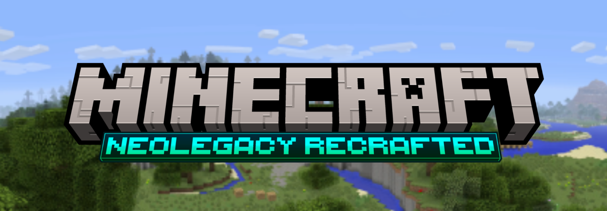
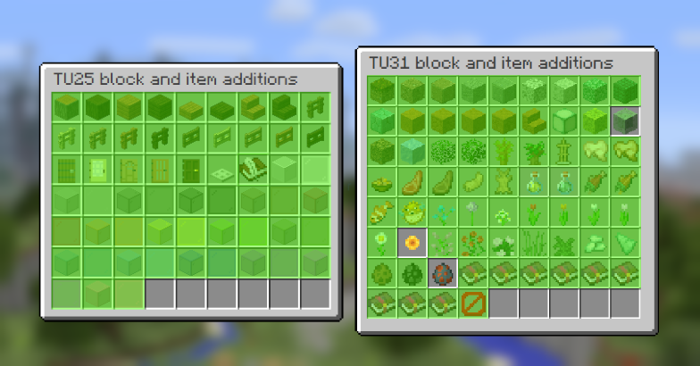

# neoLegacy Recrafted
This project aims to backport the newer title updates back to Legacy Console Edition (which is based on TU19).\
Along with that, this project will also attempt to backport some newer Java Edition features deemed 'QoL'.

### Exclusive Features
- Pick block functionality
- Leaderboard functionality
- In-game developer settings 
- Expanded graphics customization
- Modern chest dynamics (placing chests side-by-side, etc)

### In-progress Features:
- Minecraft Store functionality

### Planned Features:
- To be determined

# Our roadmap:

- Port Title Update 25 (100% complete) ( 🎉 )
- Port Title Update 31 (86.36% complete)

See our [Contributor's Guide](./CONTRIBUTING.md) for more information on the goals of this project.

# Download
Users can download our [Nightly Build](./releases/latest)! Simply download the `.zip` file and extract it!

# Acknowledgments

Huge thanks to the following projects:

- [pieeebot/neoLegacy](https://github.com/pieeebot/neoLegacy) - providing a foundation for this project to continue with
- [Patoke/LCERenewed](https://github.com/Patoke/LCERenewed) - for some of the patches that required deep decompilation
- [itsRevela/LCE-Revelations](https://github.com/itsRevela/LCE-Revelations) - for providing a stable project for neoLegacy to continue with

# Build & Run

## Windows
1. Install [Visual Studio 2022](https://aka.ms/vs/17/release/vs_community.exe) or [newer](https://visualstudio.microsoft.com/downloads/).
2. Clone the repository.
3. Open the project folder from Visual Studio.
4. Set the build configuration to **Windows64 - Debug** (Release is also ok but missing some debug features), then build and run.

## GNU/Linux

We provide both a generic build script and a Nix flake.

- Nix: `nix run .#client`
- Generic: `./build-linux.sh`
